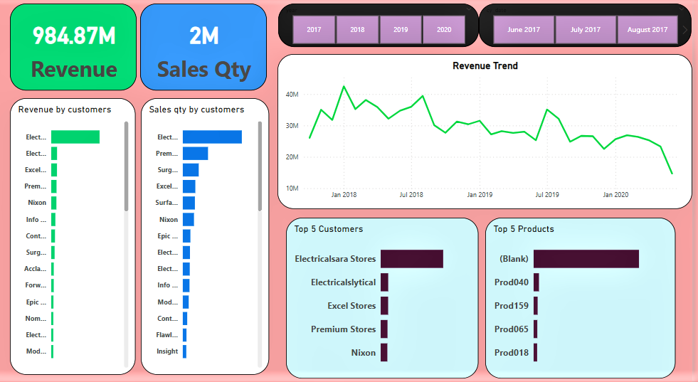
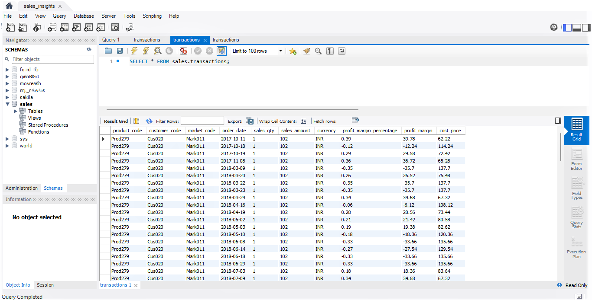
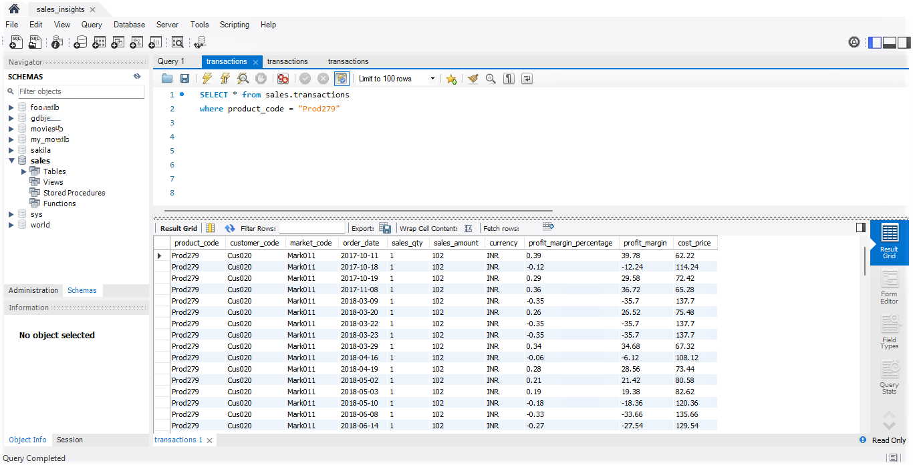
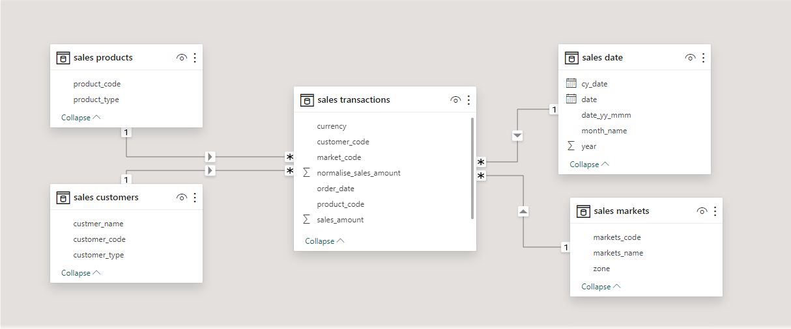

# Sales Insights
---
Created a dashboard for sales insights

## Preperation of Data

✅ Uses MySQL for Collecting and Cleaning data

✅ Connected Power BI to MySQL

✅ Setsup table relationship

✅ Created measures

✅ Created dashboard

## Objective

✅ Get insights from data

✅ Quantity sales

✅ Revenue Trend

✅ Top products

✅ Top customers

---
## Use of SQL and MySQL

---

## Table Relationship

---
## Sales Insights Dashboard

---

© 2024 Abhishek J Project Portfolio.
